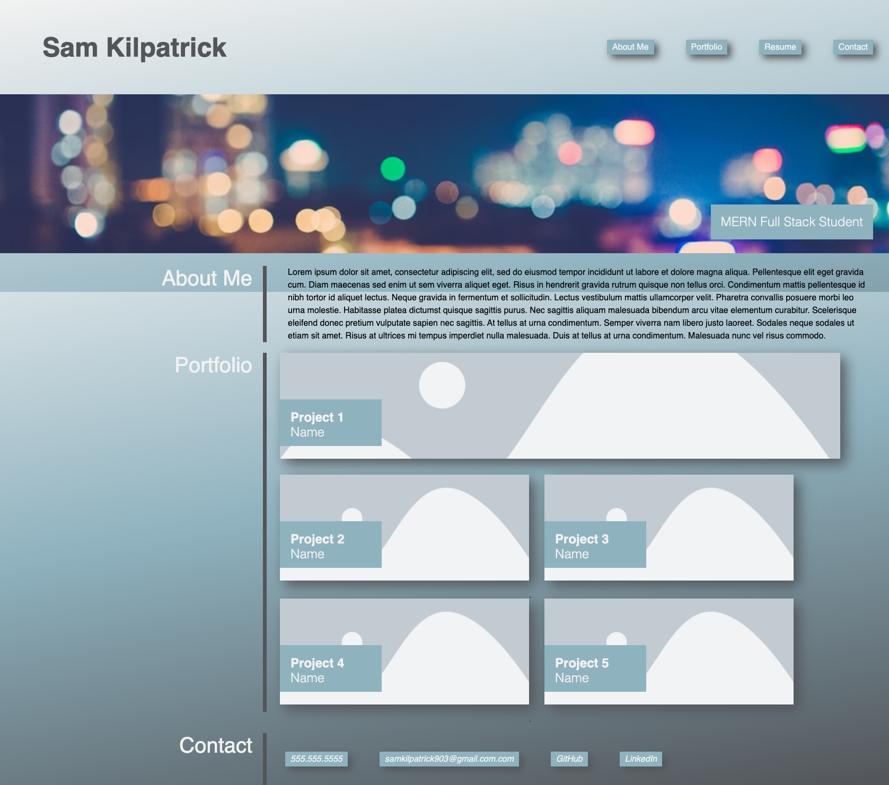

Homework 2 - Portfolio

In this project, I used HTML and CSS to create a portfolio webpage.

The webpage is fully responsive and and includes hover effects.

The body of the webpage contains 3 sections that are accessible from the nav bar links.

I collaborated with students, AskBCS, and my tutor to help form and tweak the html and CSS.

Deployed Website: https://samkilpatrick903.github.io/SK_Homework2/
Github Site: https://github.com/samkilpatrick903/SK_Homework2

